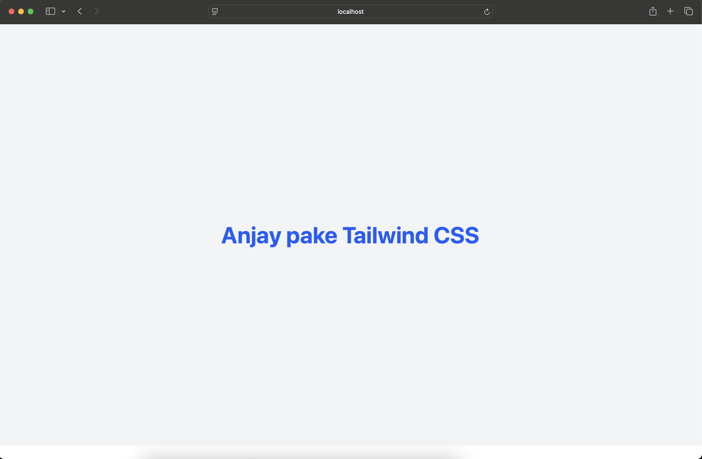

# Belajar React from Scratch, Literally!

Ini tuh materi pembelajaran frontend pake **React** yang super hands-on. Jadi cocok banget buat lo yang baru first time nyentuh React dan pengen langsung ngoding tanpa kebanyakan teori yang bikin overwhelmed.

By the end of this materi, lo bakal bikin **mini project aplikasi catatan sederhana** yang punya fitur routing dan penyimpanan data di browser. Trust me, it's gonna be fun!

---

## Tools & Teknologi

| Teknologi | Fungsi |
|---|---|
| **React** | Library buat build UI, basically the main character |
| **Vite** | Build tool yang super fast buat project React |
| **Tailwind CSS** | Framework CSS utility-first, styling jadi no ribet |
| **React Router** | Library buat navigasi antar halaman, so smooth |
| **Local Storage** | Tempat nyimpen data di browser, like a mini database |

---

## Persiapan Environment

### 1. Install Node.js

First thing first, download dan install Node.js dari situs resminya:

[https://nodejs.org](https://nodejs.org) — pilih versi **LTS** (Long Term Support) ya, yang stable.

### 2. Cek Versi Node & npm

Abis install, buka terminal terus jalanin command ini:

```bash
node -v
```

```bash
npm -v
```

Make sure Node.js-nya minimal versi **18** dan npm udah ke-install. Kalau keduanya muncul versi, it means lo udah ready to go. Let's move on.

---

## Bikin Project React pake Vite

### 1. Create New Project

Buka terminal, terus jalanin:

```bash
npm create vite@latest nama-project -- --template react
```

Bagian `nama-project` ganti pake nama project lo ya, here gue pake `catatan-app` as an example.

### 2. Masuk ke Folder Project

```bash
cd catatan-app
```

### 3. Install Dependencies

```bash
npm install
```

### 4. Run Development Server

```bash
npm run dev
```

Buka browser terus akses `http://localhost:5173` — kalau muncul halaman default React, congrats it's working.

---

## Setup Tailwind CSS

### 1. Install Tailwind CSS & Plugin Vite

```bash
npm install -D tailwindcss @tailwindcss/vite
```

### 2. Konfigurasi Vite

Buka file `vite.config.js`, terus ubah isinya jadi kayak gini:

```js
import { defineConfig } from "vite";
import react from "@vitejs/plugin-react";
import tailwindcss from "@tailwindcss/vite";

export default defineConfig({
  plugins: [react(), tailwindcss()],
});
```

### 3. Tambahin Import Tailwind di CSS

Buka file `src/index.css`, hapus semua isinya, terus ganti sama:

```css
@import "tailwindcss";
```

That's it. Literally cuma satu line doang.

### 4. Coba Tailwind CSS-nya

Buka file `src/App.jsx`, ganti isinya jadi:

```jsx
function App() {
  return (
    <div className="min-h-screen bg-gray-100 flex items-center justify-center">
      <h1 className="text-4xl font-bold text-blue-600">
        Anjay pake Tailwind CSS
      </h1>
    </div>
  );
}

export default App;
```

Save, terus cek browser. Kalau looks like gambar dibawah, gokil Tailwind udah jalan.


---

## Setup React Router

### 1. Install React Router

```bash
npm install react-router-dom
```

### 2. Konfigurasi Router

Buka file `src/main.jsx`, ubah isinya jadi:

```jsx
import { StrictMode } from "react";
import { createRoot } from "react-dom/client";
import { BrowserRouter } from "react-router-dom";
import App from "./App.jsx";
import "./index.css";

createRoot(document.getElementById("root")).render(
  <StrictMode>
    <BrowserRouter>
      <App />
    </BrowserRouter>
  </StrictMode>
);
```

### 3. Bikin Halaman Home & About

Bikin folder `src/pages/`, terus bikin dua file di dalemnya:

**`src/pages/Home.jsx`**

```jsx
import { Link } from "react-router-dom";

function Home() {
  return (
    <div className="p-8">
      <h1 className="text-3xl font-bold mb-4">Halaman Home</h1>
      <p className="text-gray-600 mb-4">Welcome to aplikasi catatan!</p>
      <Link
        to="/about"
        className="text-blue-500 underline hover:text-blue-700"
      >
        Ke halaman About
      </Link>
    </div>
  );
}

export default Home;
```

**`src/pages/About.jsx`**

```jsx
import { Link } from "react-router-dom";

function About() {
  return (
    <div className="p-8">
      <h1 className="text-3xl font-bold mb-4">Halaman About</h1>
      <p className="text-gray-600 mb-4">
        Aplikasi ini dibuat buat belajar React, React Router, dan Local
        Storage. That's basically it.
      </p>
      <Link to="/" className="text-blue-500 underline hover:text-blue-700">
        Back ke Home
      </Link>
    </div>
  );
}

export default About;
```

### 4. Daftarin Route di App.jsx

Buka `src/App.jsx`, ubah isinya:

```jsx
import { Routes, Route } from "react-router-dom";
import Home from "./pages/Home";
import About from "./pages/About";

function App() {
  return (
    <div className="min-h-screen bg-gray-100">
      <Routes>
        <Route path="/" element={<Home />} />
        <Route path="/about" element={<About />} />
      </Routes>
    </div>
  );
}

export default App;
```

Coba klik link di halaman — kalau berpindah halaman without reload, routing-nya udah work. Clean.

---

## Penggunaan Local Storage

So basically, Local Storage itu kayak "gudang kecil" di browser buat nyimpen data. The best part? Data yang disimpan **nggak hilang** even though browser-nya ditutup. Super useful buat aplikasi sederhana yang belum pake database.

### Menyimpan Data

```js
// Simpen array ke local storage
const catatan = [
  { id: 1, judul: "Belajar React", isi: "React itu seru!" },
  { id: 2, judul: "Belajar Tailwind", isi: "Styling jadi gampang." },
];

localStorage.setItem("catatan", JSON.stringify(catatan));
```

### Ngambil Data

```js
// Ambil data dari local storage
const data = localStorage.getItem("catatan");
const catatan = data ? JSON.parse(data) : [];

console.log(catatan);
```

### Hapus Data

```js
// Hapus satu item aja
localStorage.removeItem("catatan");

// Hapus semua data, clean slate
localStorage.clear();
```

> **Pro tip:** Always pake `JSON.stringify()` pas nyimpen dan `JSON.parse()` pas ngambil data, soalnya Local Storage cuma bisa nyimpen data dalam format string. Keep that in mind ya.

---

## Mini Project: Aplikasi Catatan Sederhana

Nah, this is the moment we've been waiting for. Saatnya combine semua yang udah lo pelajarin. Kita bakal bikin aplikasi catatan dengan fitur:

- Tambah catatan baru
- Hapus catatan
- Navigasi antar halaman (Home & About)
- Data tersimpan di Local Storage

### Bikin Halaman Catatan

Buat file **`src/pages/Home.jsx`** dan replace isinya sama kode berikut:

```jsx
import { useState, useEffect } from "react";
import { Link } from "react-router-dom";

function Home() {
  const [catatan, setCatatan] = useState([]);
  const [judul, setJudul] = useState("");
  const [isi, setIsi] = useState("");

  // Ambil data dari local storage pas first time render
  useEffect(() => {
    const data = localStorage.getItem("catatan");
    if (data) {
      setCatatan(JSON.parse(data));
    }
  }, []);

  // Auto-save ke local storage every time data catatan berubah
  useEffect(() => {
    localStorage.setItem("catatan", JSON.stringify(catatan));
  }, [catatan]);

  // Function buat tambah catatan
  const tambahCatatan = () => {
    if (!judul || !isi) return alert("Judul dan isi harus diisi ya!");

    const catatanBaru = {
      id: Date.now(),
      judul,
      isi,
    };

    setCatatan([...catatan, catatanBaru]);
    setJudul("");
    setIsi("");
  };

  // Function buat hapus catatan
  const hapusCatatan = (id) => {
    const filtered = catatan.filter((item) => item.id !== id);
    setCatatan(filtered);
  };

  return (
    <div className="p-8 max-w-2xl mx-auto">
      {/* Navigasi */}
      <nav className="flex gap-4 mb-8">
        <Link to="/" className="text-blue-600 font-semibold">
          Home
        </Link>
        <Link to="/about" className="text-gray-500 hover:text-blue-600">
          About
        </Link>
      </nav>

      <h1 className="text-3xl font-bold mb-6">Aplikasi Catatan</h1>

      {/* Form Input */}
      <div className="bg-white p-6 rounded-lg shadow mb-6">
        <input
          type="text"
          placeholder="Judul catatan..."
          value={judul}
          onChange={(e) => setJudul(e.target.value)}
          className="w-full border border-gray-300 rounded px-4 py-2 mb-3 focus:outline-none focus:ring-2 focus:ring-blue-400"
        />
        <textarea
          placeholder="Isi catatan..."
          value={isi}
          onChange={(e) => setIsi(e.target.value)}
          className="w-full border border-gray-300 rounded px-4 py-2 mb-3 h-24 resize-none focus:outline-none focus:ring-2 focus:ring-blue-400"
        />
        <button
          onClick={tambahCatatan}
          className="bg-blue-600 text-white px-6 py-2 rounded hover:bg-blue-700 transition cursor-pointer"
        >
          + Tambah Catatan
        </button>
      </div>

      {/* Daftar Catatan */}
      {catatan.length === 0 ? (
        <p className="text-gray-400 text-center">
          Belum ada catatan nih. Yuk tambahin!
        </p>
      ) : (
        <div className="space-y-4">
          {catatan.map((item) => (
            <div
              key={item.id}
              className="bg-white p-4 rounded-lg shadow flex justify-between items-start"
            >
              <div>
                <h3 className="font-bold text-lg">{item.judul}</h3>
                <p className="text-gray-600 mt-1">{item.isi}</p>
              </div>
              <button
                onClick={() => hapusCatatan(item.id)}
                className="text-red-500 hover:text-red-700 font-bold text-xl ml-4 cursor-pointer"
              >
                x
              </button>
            </div>
          ))}
        </div>
      )}
    </div>
  );
}

export default Home;
```

---

## Struktur Folder Project

```
catatan-app/
├── node_modules/
├── public/
├── src/
│   ├── pages/
│   │   ├── Home.jsx        # Halaman utama + fitur catatan
│   │   └── About.jsx       # Halaman about
│   ├── App.jsx             # Konfigurasi routing
│   ├── main.jsx            # Entry point + BrowserRouter
│   └── index.css           # Import Tailwind CSS
├── index.html
├── package.json
├── vite.config.js
└── README.md
```

Clean and simple. No overthinking. anjay

---

## Command buat Jalanin Project

```bash
# Masuk ke folder project
cd catatan-app

# Install semua dependencies
npm install

# Jalanin development server
npm run dev

# Build buat production
npm run build

# Preview hasil build
npm run preview
```

---

## Penutup

Kalau lo udah sampe sini dan berhasil nge-run mini project-nya, that means lo udah paham the basics of:

- Bikin project React pake **Vite**
- Styling pake **Tailwind CSS**
- Navigasi halaman pake **React Router**
- Nyimpen & ngambil data pake **Local Storage**

From here, lo bisa explore lebih jauh like nambahin fitur edit catatan, search catatan, atau even connect ke API/database beneran.

The sky is the limit. Keep learning, keep coding, and most importantly — have fun. and do not other progress 
karena elu ngoding itu buat lu bukan buat orang lain
